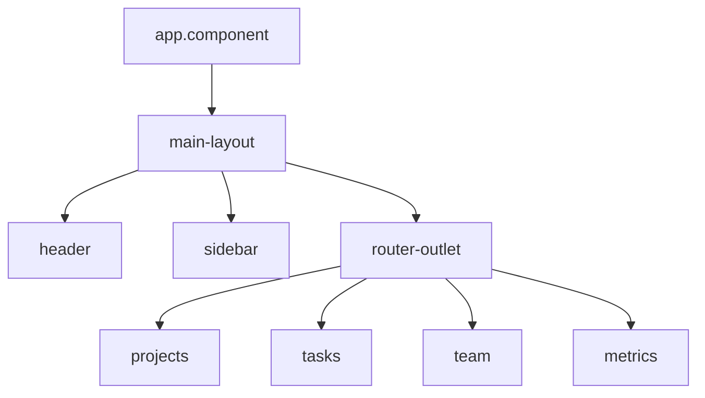

# Documentation - Habilidades

## Documentacion de Proyecto (README)

### Estructura Estandar del README.md
```markdown
# ProjectOps Dashboard

## Descripcion
Breve descripcion del proyecto y su proposito.

## Requisitos
- Node.js X.x
- Angular CLI X.x
- pnpm / npm

## Instalacion
Pasos para instalar y ejecutar.

## Arquitectura
Diagrama de la estructura del proyecto.

## Modulos
Descripcion de cada feature module.

## Tecnologias
Stack tecnologico utilizado.

## Scripts
Comandos disponibles.

## Contribucion
Como contribuir al proyecto.
```

## Comentarios JSDoc

### Para Interfaces/Modelos
```typescript
/**
 * Representa un proyecto en el sistema ProjectOps.
 *
 * @property id - Identificador unico del proyecto
 * @property name - Nombre del proyecto (max 100 caracteres)
 * @property status - Estado actual del proyecto
 * @property progress - Porcentaje de avance (0-100)
 */
export interface Project {
  id: string;
  name: string;
  // ...
}
```

### Para Servicios
```typescript
/**
 * Servicio de gestion de proyectos.
 * Proporciona operaciones CRUD con persistencia en LocalStorage
 * y estado reactivo via Signals.
 *
 * @example
 * ```typescript
 * const projectService = inject(ProjectService);
 * projectService.loadProjects();
 * const projects = projectService.projects$();
 * ```
 */
@Injectable({ providedIn: 'root' })
export class ProjectService { }
```

### Para Metodos Publicos
```typescript
/**
 * Crea un nuevo proyecto y lo persiste en LocalStorage.
 *
 * @param dto - Datos del proyecto a crear
 * @returns void - El proyecto se agrega al signal `projects$`
 * @throws Error si los datos del DTO son invalidos
 */
createProject(dto: CreateProjectDTO): void { }
```

## Documentacion de Arquitectura

### Decision Records (ADR)
```markdown
# ADR-001: Uso de Signals en lugar de RxJS para estado

## Contexto
Necesitamos un mecanismo de estado reactivo para la aplicacion.

## Decision
Usar Angular Signals (signal, computed, effect) en lugar de RxJS BehaviorSubject.

## Razones
- Signals es nativo de Angular 20
- API mas simple y menos boilerplate
- Mejor integracion con change detection
- Sin necesidad de unsubscribe

## Consecuencias
- Positivas: codigo mas limpio, menos errores de memory leak
- Negativas: menos flexibilidad para operaciones asincronas complejas
```

## Documentacion de APIs de Servicios

### Tabla de Referencia de Servicio
```markdown
## ProjectService

| Metodo | Parametros | Retorno | Descripcion |
|--------|-----------|---------|-------------|
| `loadProjects()` | - | void | Carga todos los proyectos desde LocalStorage |
| `createProject()` | `CreateProjectDTO` | void | Crea un nuevo proyecto |
| `updateProject()` | `id: string, UpdateProjectDTO` | void | Actualiza un proyecto |
| `deleteProject()` | `id: string` | void | Elimina un proyecto |

### Signals Expuestos

| Signal | Tipo | Descripcion |
|--------|------|-------------|
| `projects$` | `Signal<Project[]>` | Lista de todos los proyectos |
| `isLoading$` | `Signal<boolean>` | Estado de carga |
| `projectCount` | `Signal<number>` | Cantidad total de proyectos |
```

## Guias de Uso

### Guia de Inicio Rapido
- Requisitos previos
- Instalacion paso a paso
- Primer arranque de la aplicacion
- Navegacion basica

### Guia de Desarrollo
- Como crear un nuevo feature module
- Como agregar un nuevo modelo de datos
- Como crear un componente reutilizable
- Convenciones de codigo a seguir

## Changelog y Versionado

### Formato de Changelog
```markdown
## [1.1.0] - 2026-02-09

### Agregado
- Nuevo modulo de reportes con dashboard
- Componente de graficos con Chart Widget

### Modificado
- Mejorado rendimiento de la lista de tareas
- Actualizado sidebar con nueva navegacion

### Corregido
- Bug en filtros de proyectos que no reseteaban
- Error de tipado en TeamMember.projects
```

## Diagramas de Arquitectura (Mermaid)

```markdown

```

## Documentacion Inline en Codigo

### Cuando Agregar Comentarios
- Logica no obvia que necesita explicacion
- Workarounds con referencia al issue/bug
- Configuraciones con valores magicos
- Decisiones tecnicas no evidentes

### Cuando NO Agregar Comentarios
- Codigo auto-explicativo
- Funciones CRUD estandar
- Imports y declaraciones obvias
- Getters/setters triviales